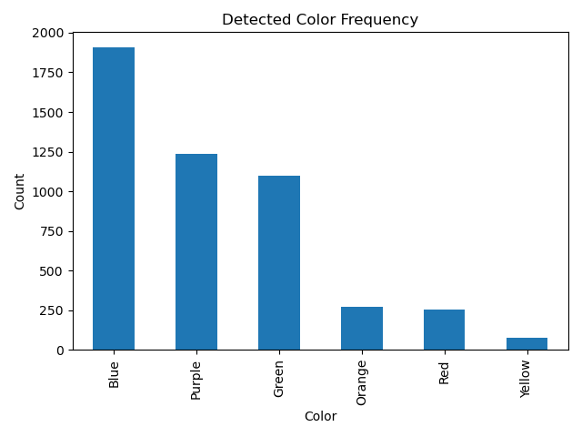

# 🎨 Real-Time Color Detection using OpenCV

A complete computer vision project that demonstrates **real-time color detection** using a webcam.  
The project covers **basic image processing, HSV-based color detection, dominant color extraction, data logging, visualization, and ML-based classification**.

🚀 Beginner → Intermediate → ML-level progression in one repository.

---

## 🔥 Features

✅ Real-time webcam color detection  
✅ Mouse click RGB detection (baseline)  
✅ HSV-based color detection (industry standard)  
✅ Automatic CSV logging of detected colors  
✅ Dominant color detection (no user input)  
✅ Machine Learning classification using kNN  
✅ Data visualization (color frequency graph)  
✅ Demo GIF + screenshots  

---

## 📁 Project Structure

real-time-color-detection-opencv/
│
├── data/
│ └── colors.csv
│
├── src/
│ ├── option_c_click_rgb.py
│ ├── option_a_hsv_csv.py
│ ├── option_b_dominant_ml.py
│ └── plot_color_graph.py
│
├── outputs/
│ └── color_frequency.png
│
├── screenshots/
│ ├── option_c_click.png
│ ├── option_a_hsv.png
│ ├── option_b_ml.png
│ └── demo.gif
│
├── requirements.txt
└── README.md
## 🧪 Implemented Approaches

### 🔹 Option C — Click-Based RGB Detection
- Detects color by clicking on a pixel
- Uses RGB distance matching
- Beginner-friendly baseline

### 🔹 Option A — HSV + CSV Logging (Recommended)
- Uses HSV color space (robust to lighting)
- Logs detected colors into CSV
- Industry-relevant approach

### 🔹 Option B — Dominant Color + ML (Advanced)
- Automatically detects dominant color in frame
- Uses K-Means clustering
- Classifies color using kNN (Machine Learning)

---

## 📊 Data Analysis

Detected color frequency visualization:



---

## ⚙️ Tech Stack

- Python 3
- OpenCV
- NumPy
- Pandas
- Matplotlib
- Scikit-learn

---

## ▶️ How to Run

### 1️⃣ Install dependencies
```bash
pip install -r requirements.txt
2️⃣ Run HSV-based detection
cd src
python option_a_hsv_csv.py
3️⃣ Generate color frequency graph
python plot_color_graph.py
4️⃣ Run ML-based dominant color detection
python option_b_dominant_ml.py
